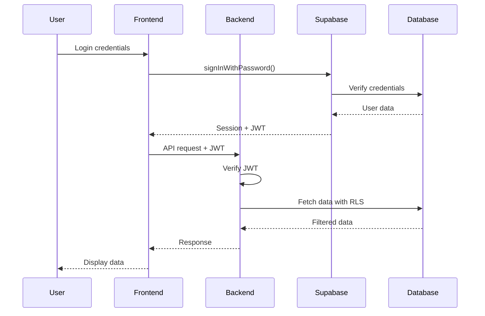

# 📚 Real Estate AI Agent Platform - Master Technical Documentation

> **Version**: 1.0.0  
> **Last Updated**: August 8, 2025  
> **Purpose**: Single source of truth for system architecture, implementation details, and debugging reference

---

## Table of Contents

1. [System Overview](#system-overview)
2. [Architecture](#architecture)
3. [Technology Stack](#technology-stack)
4. [Database Schema](#database-schema)
5. [API Documentation](#api-documentation)
6. [Feature Implementation](#feature-implementation)
7. [Authentication & Security](#authentication--security)
8. [Integrations](#integrations)
9. [Frontend Architecture](#frontend-architecture)
10. [Business Logic Systems](#business-logic-systems)
11. [Deployment & DevOps](#deployment--devops)
12. [Known Issues & Solutions](#known-issues--solutions)
13. [Performance Optimization](#performance-optimization)
14. [Testing Strategy](#testing-strategy)
15. [Development Guidelines](#development-guidelines)

---

## 🌐 System Overview

### Purpose
A comprehensive real estate platform enabling businesses to deploy AI-powered agents for lead qualification, property estimation, and customer engagement across multiple channels (web, Facebook Messenger, website embeds).

### Core Capabilities
- **AI-Powered Conversations**: GPT-4 driven chat with context awareness
- **Multi-Channel Support**: Web, Facebook Messenger, embedded widgets
- **Lead Qualification**: Automated BANT scoring and lead management
- **Property Estimation**: Multi-step property valuation flows
- **Document Intelligence**: PDF processing with RAG (Retrieval Augmented Generation)
- **Human-in-Loop**: Seamless handoff between AI and human agents
- **Multi-Tenant**: Organization-based isolation with role-based access

### Key Metrics
- Response Time: <2s for chat responses
- Uptime Target: 99.9%
- Lead Qualification Rate: 70%+
- Document Processing: Up to 10MB PDFs
- Concurrent Users: 500+ supported

---

## 🏗️ Architecture

### System Architecture

```
┌─────────────────────────────────────────────────────────────┐
│                         FRONTEND                             │
│  Next.js 15 App Router + React 18 + TypeScript + Tailwind   │
│                    Port: 3000                                │
└─────────────────┬───────────────────────────────────────────┘
                  │ HTTP/HTTPS
                  ▼
┌─────────────────────────────────────────────────────────────┐
│                         BACKEND                              │
│        Express.js + Node.js 18 + JavaScript                  │
│                    Port: 3001                                │
└─────────────────┬───────────────────────────────────────────┘
                  │
        ┌─────────┴─────────┬─────────────┬──────────────┐
        ▼               ▼               ▼              ▼
┌──────────────┐ ┌──────────────┐ ┌──────────┐ ┌──────────────┐
│   Supabase   │ │   OpenAI     │ │ Facebook │ │    Resend    │
│  PostgreSQL  │ │   GPT-4      │ │ Messenger│ │    Email     │
│Auth│RLS│Real │ │  Embeddings  │ │  Webhook │ │   Service    │
└──────────────┘ └──────────────┘ └──────────┘ └──────────────┘
```

### Directory Structure

```
REAL-ESTATE-WEB-APP/
├── BACKEND/                      # Backend API server
│   ├── server.js                 # Main server entry (4000+ lines)
│   ├── middleware/               # Express middleware
│   ├── __tests__/               # Test files
│   ├── *.sql                    # Database schemas
│   └── package.json             # Backend dependencies
│
├── FRONTEND/                    # Frontend applications
│   └── financial-dashboard-2/  # Main production frontend
│       ├── app/                # Next.js app router pages
│       ├── components/         # React components
│       ├── contexts/          # React contexts
│       ├── hooks/            # Custom React hooks
│       ├── lib/             # Utilities and API clients
│       └── public/         # Static assets
│
└── Documentation Files
    ├── TECHNICAL_DOCUMENTATION_MASTER.md (this file)
    ├── INVITATION_SYSTEM_IMPROVEMENTS.md
    └── CLAUDE.md files (AI assistant instructions)
```

---

## 💻 Technology Stack

### Backend Technologies

| Category | Technology | Version | Purpose |
|----------|-----------|---------|---------|
| Runtime | Node.js | 18+ | JavaScript runtime |
| Framework | Express.js | 4.18.2 | Web application framework |
| Database | PostgreSQL | via Supabase | Primary data store |
| Auth | Supabase Auth | 2.52.0 | User authentication |
| AI/ML | OpenAI API | 4.20.0 | Chat & embeddings |
| Email | Resend | 6.0.0 | Transactional emails |
| Security | Helmet.js | 7.2.0 | Security headers |
| Security | JWT | 9.0.2 | Token authentication |
| File Processing | Multer | 2.0.2 | File uploads |
| File Processing | pdf-parse | 1.1.1 | PDF text extraction |
| Rate Limiting | express-rate-limit | 7.5.1 | API rate limiting |
| Environment | dotenv | 16.4.5 | Environment variables |

### Frontend Technologies

| Category | Technology | Version | Purpose |
|----------|-----------|---------|---------|
| Framework | Next.js | 15.0.3 | React framework |
| UI Library | React | 18.3.1 | Component library |
| Language | TypeScript | 5.x | Type safety |
| Styling | Tailwind CSS | 3.4.17 | Utility CSS |
| UI Components | shadcn/ui | Latest | Component library |
| Icons | Lucide React | 0.454.0 | Icon library |
| State Management | TanStack Query | 5.62.11 | Server state |
| Notifications | Sonner | 1.7.1 | Toast notifications |
| Forms | React Hook Form | 7.54.2 | Form management |
| Validation | Zod | 3.24.1 | Schema validation |
| Charts | Recharts | 2.15.0 | Data visualization |
| Date Handling | date-fns | 4.1.0 | Date utilities |

---

## 🗄️ Database Schema

### Core Tables

#### `organizations`
```sql
CREATE TABLE organizations (
  id UUID PRIMARY KEY DEFAULT gen_random_uuid(),
  name TEXT NOT NULL,
  created_at TIMESTAMPTZ DEFAULT NOW(),
  updated_at TIMESTAMPTZ DEFAULT NOW()
);
```

#### `organization_members`
```sql
CREATE TABLE organization_members (
  id UUID PRIMARY KEY DEFAULT gen_random_uuid(),
  organization_id UUID REFERENCES organizations(id),
  user_id UUID REFERENCES auth.users(id),
  role TEXT CHECK (role IN ('admin', 'moderator', 'agent', 'member', 'viewer')),
  joined_at TIMESTAMPTZ DEFAULT NOW(),
  invited_at TIMESTAMPTZ,
  UNIQUE(organization_id, user_id)
);
```

#### `organization_invites`
```sql
CREATE TABLE organization_invites (
  id UUID PRIMARY KEY DEFAULT gen_random_uuid(),
  organization_id UUID REFERENCES organizations(id),
  email TEXT NOT NULL,
  token TEXT UNIQUE NOT NULL,
  role TEXT DEFAULT 'member',
  status TEXT DEFAULT 'pending' CHECK (status IN ('pending', 'accepted', 'expired')),
  invited_by UUID REFERENCES auth.users(id),
  created_at TIMESTAMPTZ DEFAULT NOW(),
  expires_at TIMESTAMPTZ DEFAULT NOW() + INTERVAL '7 days',
  accepted_at TIMESTAMPTZ
);
```

#### `agents`
```sql
CREATE TABLE agents (
  id UUID PRIMARY KEY DEFAULT gen_random_uuid(),
  user_id UUID REFERENCES auth.users(id),
  organization_id UUID REFERENCES organizations(id),
  name TEXT NOT NULL,
  prompt TEXT,
  greeting_message TEXT,
  primary_color VARCHAR(7) DEFAULT '#000000',
  chat_icon_url TEXT,
  suggested_messages JSONB DEFAULT '[]'::jsonb,
  initial_questions JSONB DEFAULT '[]'::jsonb,
  status VARCHAR(20) DEFAULT 'active',
  facebook_page_id TEXT,
  facebook_page_access_token TEXT,
  bant_enabled BOOLEAN DEFAULT true,
  bant_config JSONB,
  voice_id TEXT,
  language VARCHAR(10) DEFAULT 'en',
  timezone VARCHAR(50) DEFAULT 'UTC',
  business_hours JSONB,
  auto_reply_enabled BOOLEAN DEFAULT true,
  handoff_enabled BOOLEAN DEFAULT true,
  created_at TIMESTAMPTZ DEFAULT NOW(),
  updated_at TIMESTAMPTZ DEFAULT NOW()
);
```

#### `conversations`
```sql
CREATE TABLE conversations (
  id UUID PRIMARY KEY DEFAULT gen_random_uuid(),
  agent_id UUID REFERENCES agents(id),
  lead_id UUID REFERENCES leads(id),
  source VARCHAR(20) CHECK (source IN ('web', 'facebook', 'embed')),
  status VARCHAR(20) DEFAULT 'active',
  mode VARCHAR(20) DEFAULT 'ai' CHECK (mode IN ('ai', 'human', 'handoff_requested')),
  metadata JSONB DEFAULT '{}'::jsonb,
  started_at TIMESTAMPTZ DEFAULT NOW(),
  ended_at TIMESTAMPTZ,
  last_message_at TIMESTAMPTZ DEFAULT NOW()
);
```

#### `messages`
```sql
CREATE TABLE messages (
  id UUID PRIMARY KEY DEFAULT gen_random_uuid(),
  conversation_id UUID REFERENCES conversations(id),
  role VARCHAR(20) CHECK (role IN ('user', 'assistant', 'system', 'human_agent')),
  content TEXT NOT NULL,
  metadata JSONB DEFAULT '{}'::jsonb,
  created_at TIMESTAMPTZ DEFAULT NOW()
);
```

#### `leads`
```sql
CREATE TABLE leads (
  id UUID PRIMARY KEY DEFAULT gen_random_uuid(),
  organization_id UUID REFERENCES organizations(id),
  agent_id UUID REFERENCES agents(id),
  email TEXT,
  phone TEXT,
  name TEXT,
  company TEXT,
  budget_min DECIMAL,
  budget_max DECIMAL,
  authority_level VARCHAR(50),
  need_description TEXT,
  timeline VARCHAR(50),
  bant_score INTEGER DEFAULT 0 CHECK (bant_score >= 0 AND bant_score <= 100),
  status VARCHAR(20) DEFAULT 'new',
  source VARCHAR(20),
  notes TEXT,
  metadata JSONB DEFAULT '{}'::jsonb,
  created_at TIMESTAMPTZ DEFAULT NOW(),
  updated_at TIMESTAMPTZ DEFAULT NOW(),
  last_contact_at TIMESTAMPTZ
);
```

#### `bant_memory`
```sql
CREATE TABLE bant_memory (
  id UUID PRIMARY KEY DEFAULT gen_random_uuid(),
  conversation_id UUID REFERENCES conversations(id) UNIQUE,
  budget_discussed BOOLEAN DEFAULT false,
  authority_discussed BOOLEAN DEFAULT false,
  need_discussed BOOLEAN DEFAULT false,
  timeline_discussed BOOLEAN DEFAULT false,
  budget_info JSONB,
  authority_info JSONB,
  need_info JSONB,
  timeline_info JSONB,
  next_question VARCHAR(20),
  created_at TIMESTAMPTZ DEFAULT NOW(),
  updated_at TIMESTAMPTZ DEFAULT NOW()
);
```

#### `estimation_memory`
```sql
CREATE TABLE estimation_memory (
  id UUID PRIMARY KEY DEFAULT gen_random_uuid(),
  conversation_id UUID REFERENCES conversations(id) UNIQUE,
  property_type VARCHAR(50),
  payment_plan VARCHAR(50),
  location TEXT,
  specifications JSONB,
  estimated_value DECIMAL,
  estimation_stage VARCHAR(50),
  created_at TIMESTAMPTZ DEFAULT NOW(),
  updated_at TIMESTAMPTZ DEFAULT NOW()
);
```

#### `agent_embeddings`
```sql
CREATE TABLE agent_embeddings (
  id UUID PRIMARY KEY DEFAULT gen_random_uuid(),
  agent_id UUID REFERENCES agents(id),
  document_id UUID REFERENCES documents(id),
  chunk_index INTEGER,
  content TEXT NOT NULL,
  embedding vector(1536),
  metadata JSONB DEFAULT '{}'::jsonb,
  created_at TIMESTAMPTZ DEFAULT NOW()
);
```

#### `documents`
```sql
CREATE TABLE documents (
  id UUID PRIMARY KEY DEFAULT gen_random_uuid(),
  agent_id UUID REFERENCES agents(id),
  filename TEXT NOT NULL,
  file_type VARCHAR(50),
  file_size INTEGER,
  file_path TEXT,
  processed BOOLEAN DEFAULT false,
  error_message TEXT,
  created_at TIMESTAMPTZ DEFAULT NOW(),
  processed_at TIMESTAMPTZ
);
```

#### `conversation_handoffs`
```sql
CREATE TABLE conversation_handoffs (
  id UUID PRIMARY KEY DEFAULT gen_random_uuid(),
  conversation_id UUID REFERENCES conversations(id),
  requested_by VARCHAR(20) DEFAULT 'customer',
  reason TEXT,
  priority VARCHAR(20) DEFAULT 'normal',
  status VARCHAR(20) DEFAULT 'pending',
  assigned_agent_id UUID REFERENCES auth.users(id),
  requested_at TIMESTAMPTZ DEFAULT NOW(),
  accepted_at TIMESTAMPTZ,
  resolved_at TIMESTAMPTZ
);
```

### Database Indexes

```sql
-- Performance indexes
CREATE INDEX idx_conversations_agent_id ON conversations(agent_id);
CREATE INDEX idx_conversations_lead_id ON conversations(lead_id);
CREATE INDEX idx_messages_conversation_id ON messages(conversation_id);
CREATE INDEX idx_messages_created_at ON messages(created_at DESC);
CREATE INDEX idx_leads_organization_id ON leads(organization_id);
CREATE INDEX idx_leads_bant_score ON leads(bant_score DESC);
CREATE INDEX idx_agent_embeddings_agent_id ON agent_embeddings(agent_id);
CREATE INDEX idx_organization_members_user_id ON organization_members(user_id);
CREATE INDEX idx_organization_invites_token ON organization_invites(token);
CREATE INDEX idx_organization_invites_email ON organization_invites(email);
```

### Row Level Security (RLS) Policies

```sql
-- Enable RLS on all tables
ALTER TABLE organizations ENABLE ROW LEVEL SECURITY;
ALTER TABLE organization_members ENABLE ROW LEVEL SECURITY;
ALTER TABLE agents ENABLE ROW LEVEL SECURITY;
ALTER TABLE conversations ENABLE ROW LEVEL SECURITY;
ALTER TABLE messages ENABLE ROW LEVEL SECURITY;
ALTER TABLE leads ENABLE ROW LEVEL SECURITY;

-- Example RLS policies
CREATE POLICY "Users can view their organization's data"
  ON organizations FOR SELECT
  USING (id IN (
    SELECT organization_id FROM organization_members 
    WHERE user_id = auth.uid()
  ));

CREATE POLICY "Users can manage their own agents"
  ON agents FOR ALL
  USING (user_id = auth.uid() OR organization_id IN (
    SELECT organization_id FROM organization_members 
    WHERE user_id = auth.uid()
  ));
```

---

## 🔌 API Documentation

### Authentication Endpoints

#### POST `/api/auth/signup`
**Purpose**: Register new user account  
**Authentication**: None  
**Request Body**:
```json
{
  "email": "user@example.com",
  "password": "SecurePassword123!",
  "firstName": "John",
  "lastName": "Doe"
}
```
**Response**: 
```json
{
  "user": { "id": "uuid", "email": "..." },
  "session": { "access_token": "jwt_token" }
}
```

#### POST `/api/auth/login`
**Purpose**: User login  
**Authentication**: None  
**Request Body**:
```json
{
  "email": "user@example.com",
  "password": "SecurePassword123!"
}
```
**Response**: 
```json
{
  "user": { "id": "uuid", "email": "..." },
  "token": "jwt_token"
}
```

#### GET `/api/auth/invite/verify`
**Purpose**: Verify invitation token validity  
**Authentication**: None  
**Query Parameters**: `token=invitation_token`  
**Response**:
```json
{
  "valid": true,
  "email": "invited@example.com",
  "organizationName": "Company Name",
  "organizationId": "uuid",
  "expiresAt": "2025-08-15T12:00:00Z",
  "userExists": false,
  "token": "invitation_token"
}
```

#### POST `/api/auth/invite/accept`
**Purpose**: Accept organization invitation  
**Authentication**: None  
**Request Body**:
```json
{
  "token": "invitation_token",
  "password": "SecurePassword123!",
  "firstName": "John",
  "lastName": "Doe",
  "existingUser": false
}
```
**Response**:
```json
{
  "message": "Successfully joined organization",
  "user": { "id": "uuid", "email": "..." },
  "session": { "access_token": "jwt_token" },
  "token": "jwt_token",
  "organization": {
    "id": "uuid",
    "name": "Company Name",
    "role": "member"
  },
  "isNewUser": true,
  "requiresEmailConfirmation": false
}
```

### Agent Management Endpoints

#### GET `/api/agents`
**Purpose**: List user's agents  
**Authentication**: Required (Bearer token)  
**Response**:
```json
{
  "agents": [
    {
      "id": "uuid",
      "name": "Sales Agent",
      "status": "active",
      "prompt": "...",
      "greeting_message": "...",
      "bant_enabled": true,
      "created_at": "2025-08-01T00:00:00Z"
    }
  ]
}
```

#### POST `/api/agents`
**Purpose**: Create new agent  
**Authentication**: Required  
**Request Body**:
```json
{
  "name": "Sales Agent",
  "prompt": "You are a helpful sales assistant...",
  "greeting_message": "Hello! How can I help you today?",
  "primary_color": "#0066CC",
  "bant_enabled": true,
  "bant_config": {
    "budget_weight": 30,
    "authority_weight": 25,
    "need_weight": 25,
    "timeline_weight": 20,
    "qualification_threshold": 60
  }
}
```

#### PUT `/api/agents/:id`
**Purpose**: Update agent configuration  
**Authentication**: Required  
**Request Body**: Same as POST /api/agents

#### DELETE `/api/agents/:id`
**Purpose**: Delete agent  
**Authentication**: Required  
**Response**: `{ "message": "Agent deleted successfully" }`

#### POST `/api/documents`
**Purpose**: Upload agent training documents  
**Authentication**: Required  
**Request**: Multipart form data with `file` and `agentId`  
**Response**:
```json
{
  "document": {
    "id": "uuid",
    "filename": "training.pdf",
    "processed": false
  }
}
```

### Conversation Endpoints

#### POST `/api/chat`
**Purpose**: Main chat endpoint with streaming  
**Authentication**: Optional  
**Request Body**:
```json
{
  "message": "I'm looking for a property",
  "agentId": "uuid",
  "conversationId": "uuid",
  "source": "web"
}
```
**Response**: Server-Sent Events (SSE) stream

#### GET `/api/messages/:conversationId`
**Purpose**: Poll messages for a conversation  
**Authentication**: Optional  
**Query Parameters**: `lastMessageId=uuid`  
**Response**:
```json
{
  "messages": [
    {
      "id": "uuid",
      "role": "user",
      "content": "Hello",
      "created_at": "2025-08-08T12:00:00Z"
    }
  ]
}
```

#### GET `/api/conversations`
**Purpose**: List conversations  
**Authentication**: Required  
**Query Parameters**: 
- `status`: active, archived, handoff
- `mode`: ai, human
- `limit`: number (default 50)
- `offset`: number (default 0)

#### POST `/api/conversations/:id/request-handoff`
**Purpose**: Request human agent handoff  
**Authentication**: Required  
**Request Body**:
```json
{
  "reason": "Customer requested human assistance",
  "priority": "high"
}
```

#### POST `/api/conversations/:id/accept-handoff`
**Purpose**: Accept handoff as human agent  
**Authentication**: Required  
**Response**:
```json
{
  "message": "Handoff accepted",
  "conversation": { "id": "uuid", "mode": "human" }
}
```

### Lead Management Endpoints

#### GET `/api/leads`
**Purpose**: List leads with filtering  
**Authentication**: Required  
**Query Parameters**:
- `organizationId`: UUID
- `status`: new, contacted, qualified, converted
- `minScore`: 0-100
- `source`: web, facebook, embed
- `startDate`: ISO date
- `endDate`: ISO date
- `limit`: number
- `offset`: number

#### POST `/api/leads`
**Purpose**: Create or update lead  
**Authentication**: Required  
**Request Body**:
```json
{
  "email": "lead@example.com",
  "name": "John Doe",
  "phone": "+1234567890",
  "company": "ABC Corp",
  "budget_min": 100000,
  "budget_max": 500000,
  "authority_level": "decision_maker",
  "need_description": "Looking for office space",
  "timeline": "3_months",
  "source": "web"
}
```

#### PUT `/api/leads/:id`
**Purpose**: Update lead details  
**Authentication**: Required  
**Request Body**: Partial lead object

#### GET `/api/leads/export`
**Purpose**: Export leads to CSV  
**Authentication**: Required  
**Query Parameters**: Same as GET /api/leads  
**Response**: CSV file download

### Organization Management Endpoints

#### GET `/api/organizations`
**Purpose**: Get user's organizations  
**Authentication**: Required  
**Response**:
```json
{
  "organizations": [
    {
      "id": "uuid",
      "name": "Company Name",
      "role": "admin",
      "member_count": 5
    }
  ]
}
```

#### POST `/api/organizations`
**Purpose**: Create new organization  
**Authentication**: Required  
**Request Body**:
```json
{
  "name": "New Company"
}
```

#### POST `/api/organization/invite`
**Purpose**: Invite member to organization  
**Authentication**: Required (admin/moderator only)  
**Request Body**:
```json
{
  "email": "newmember@example.com",
  "organizationId": "uuid",
  "role": "member"
}
```
**Response**:
```json
{
  "message": "Invitation created successfully",
  "inviteLink": "http://localhost:3000/auth/invite?token=...",
  "email": "newmember@example.com"
}
```

#### GET `/api/organization/members`
**Purpose**: List organization members  
**Authentication**: Required  
**Query Parameters**: `organizationId=uuid`

#### DELETE `/api/organization/members/:userId`
**Purpose**: Remove member from organization  
**Authentication**: Required (admin only)

### User Settings Endpoints

#### GET `/api/settings/profile`
**Purpose**: Get user profile  
**Authentication**: Required  
**Response**:
```json
{
  "profile": {
    "id": "uuid",
    "email": "user@example.com",
    "first_name": "John",
    "last_name": "Doe",
    "avatar_url": "https://...",
    "notification_preferences": {}
  }
}
```

#### PUT `/api/settings/profile`
**Purpose**: Update user profile  
**Authentication**: Required  
**Request Body**:
```json
{
  "first_name": "John",
  "last_name": "Doe",
  "notification_preferences": {
    "email": true,
    "sms": false,
    "push": true
  }
}
```

### Webhook Endpoints

#### POST `/webhook/facebook`
**Purpose**: Facebook Messenger webhook  
**Authentication**: Facebook verification  
**Headers**: `X-Hub-Signature-256` for request validation

#### GET `/webhook/facebook`
**Purpose**: Facebook webhook verification  
**Query Parameters**: 
- `hub.mode`: subscribe
- `hub.verify_token`: verification token
- `hub.challenge`: challenge string

### Utility Endpoints

#### GET `/api/health`
**Purpose**: Health check endpoint  
**Authentication**: None  
**Response**:
```json
{
  "status": "healthy",
  "timestamp": "2025-08-08T12:00:00Z",
  "services": {
    "database": "connected",
    "openai": "connected",
    "redis": "connected"
  }
}
```

---

## 🎯 Feature Implementation

### 1. AI-Powered Chat System

**Implementation Details**:
- Uses OpenAI GPT-4 for response generation
- Context window management (4096 tokens)
- Conversation memory using message history
- System prompts customizable per agent
- Streaming responses via Server-Sent Events (SSE)

**Data Flow**:
```
User Message → API Gateway → Auth Check → Agent Validation 
→ Context Retrieval → OpenAI API → Response Streaming → Database Storage
```

**Key Files**:
- Backend: `server.js` (lines 2000-2500)
- Frontend: `hooks/use-message-streaming.tsx`
- Components: `components/chat/chat-interface.tsx`

### 2. BANT Lead Qualification

**Scoring Algorithm**:
```javascript
score = (budget_score * 0.30) + 
        (authority_score * 0.25) + 
        (need_score * 0.25) + 
        (timeline_score * 0.20)
```

**Qualification Stages**:
1. **Budget Assessment**: Financial capacity evaluation
2. **Authority Identification**: Decision-making power
3. **Need Analysis**: Problem/requirement understanding
4. **Timeline Determination**: Implementation timeframe

**Memory Persistence**:
- Stores conversation state in `bant_memory` table
- Tracks which aspects have been discussed
- Maintains context across conversation sessions

**Key Files**:
- Components: `components/bant/bant-qualification-scoring.tsx`
- Backend: `server.js` (BANT logic sections)

### 3. Document Processing & RAG

**Processing Pipeline**:
1. **Upload**: Multipart form upload via Multer
2. **Storage**: Save to Supabase Storage
3. **Extraction**: Parse PDF text with pdf-parse
4. **Chunking**: Split into 1000-char chunks with 100-char overlap
5. **Embedding**: Generate vectors with OpenAI text-embedding-ada-002
6. **Storage**: Store vectors in `agent_embeddings` table
7. **Retrieval**: Semantic search using pgvector

**Retrieval Algorithm**:
```sql
SELECT content, 1 - (embedding <=> query_embedding) as similarity
FROM agent_embeddings
WHERE agent_id = $1
ORDER BY similarity DESC
LIMIT 5
```

### 4. Multi-Channel Support

**Web Chat**:
- Embedded widget via iframe
- PostMessage API for cross-origin communication
- Session persistence with localStorage

**Facebook Messenger**:
- Webhook endpoint for message reception
- Page Access Token for sending messages
- Signature verification for security

**Embed Widget**:
- Customizable appearance (colors, position)
- Auto-initialization script
- Responsive design

### 5. Human-in-Loop System

**Handoff Triggers**:
- Customer request for human agent
- AI uncertainty threshold exceeded
- Complex query detection
- Business hours consideration

**Queue Management**:
- Priority-based routing (high, normal, low)
- Agent availability tracking
- Real-time status updates via WebSocket

**Context Preservation**:
- Full conversation history transfer
- BANT qualification status
- Customer information
- Previous interaction summary

### 6. Organization Management

**Multi-Tenancy**:
- Organization-level data isolation
- Shared agent configurations
- Centralized billing and usage tracking

**Role Hierarchy**:
```
Admin → Full access, billing, member management
Moderator → Agent management, invitations
Agent → Conversation handling, lead management  
Member → Basic access, view-only permissions
Viewer → Read-only access
```

**Invitation System**:
- Unique token generation (crypto.randomBytes)
- Email delivery via Resend
- Auto-confirmation for invited users
- 7-day expiration period

### 7. Notification System

**Channels**:
- In-app notifications (real-time)
- Email notifications (Resend)
- SMS notifications (configured, not implemented)
- Push notifications (PWA support)

**Event Types**:
- New lead qualified
- Handoff requested
- Message received
- Agent status change
- System alerts

**Preference Management**:
- User-level settings
- Channel-specific toggles
- Frequency controls
- Do-not-disturb schedules

### 8. Property Estimation System

**Flow Stages**:
1. **Property Type Selection**: Apartment, Villa, Townhouse
2. **Location Input**: Area/neighborhood selection
3. **Specifications**: Bedrooms, bathrooms, size
4. **Payment Plan**: Cash, installment options
5. **Value Calculation**: Market-based estimation

**Memory Management**:
- Stage tracking in `estimation_memory`
- Progressive data collection
- Validation at each step
- Result caching

### 9. Analytics & Reporting

**Metrics Tracked**:
- Total conversations
- Lead conversion rate
- Average response time
- BANT qualification rate
- Agent performance
- Revenue attribution

**Dashboard Components**:
- Real-time statistics
- Trend charts (Recharts)
- Lead funnel visualization
- Agent comparison
- Time-based filtering

### 10. File Attachment System

**Supported Types**:
- Images: JPEG, PNG, GIF (max 5MB)
- Documents: PDF, DOC, DOCX (max 10MB)

**Processing**:
- Client-side validation
- Virus scanning (planned)
- Compression for images
- Secure storage in Supabase

**Features**:
- Drag-and-drop upload
- Preview functionality
- Multiple file selection
- Progress indicators

---

## 🔐 Authentication & Security

### Authentication Flow



### Security Measures

#### Request Security
```javascript
// Helmet.js configuration
app.use(helmet({
  contentSecurityPolicy: {
    directives: {
      defaultSrc: ["'self'"],
      scriptSrc: ["'self'", "'unsafe-inline'"],
      styleSrc: ["'self'", "'unsafe-inline'"],
      imgSrc: ["'self'", "data:", "https:"],
      connectSrc: ["'self'", "https:"],
    }
  },
  crossOriginEmbedderPolicy: false
}));

// CORS configuration
const allowedOrigins = [
  'http://localhost:3000',
  'http://localhost:3001',
  'https://production-domain.com'
];

// Rate limiting
const limiter = rateLimit({
  windowMs: 1 * 60 * 1000, // 1 minute
  max: 500, // requests per window
  skipSuccessfulRequests: false
});
```

#### JWT Authentication
```javascript
// Middleware for protected routes
async function requireAuth(req, res, next) {
  const token = req.headers.authorization?.replace('Bearer ', '');
  
  if (!token) {
    return res.status(401).json({ error: 'No token provided' });
  }
  
  try {
    const decoded = jwt.verify(token, process.env.JWT_SECRET);
    req.user = decoded;
    next();
  } catch (error) {
    return res.status(401).json({ error: 'Invalid token' });
  }
}
```

#### Input Validation
- Zod schema validation for request bodies
- SQL injection prevention via parameterized queries
- XSS protection through content sanitization
- File type and size validation for uploads

#### Data Protection
- Password hashing with bcrypt (Supabase managed)
- Sensitive data encryption at rest
- HTTPS enforcement in production
- Environment variable protection
- API key rotation schedule

### Role-Based Access Control (RBAC)

```javascript
// Permission matrix
const permissions = {
  admin: ['*'], // All permissions
  moderator: ['agents:*', 'invites:create', 'members:read'],
  agent: ['conversations:*', 'leads:*', 'agents:read'],
  member: ['conversations:read', 'leads:read'],
  viewer: ['*:read'] // Read-only access
};

// Middleware for permission checking
function requirePermission(resource, action) {
  return (req, res, next) => {
    const userRole = req.user.role;
    const permission = `${resource}:${action}`;
    
    if (hasPermission(userRole, permission)) {
      next();
    } else {
      res.status(403).json({ error: 'Insufficient permissions' });
    }
  };
}
```

---

## 🔗 Integrations

### OpenAI Integration

**Configuration**:
```javascript
const openai = new OpenAI({
  apiKey: process.env.OPENAI_API_KEY,
  timeout: 60000,
  maxRetries: 3
});
```

**Chat Completion**:
```javascript
const completion = await openai.chat.completions.create({
  model: "gpt-4",
  messages: [
    { role: "system", content: agent.prompt },
    ...conversationHistory,
    { role: "user", content: userMessage }
  ],
  temperature: 0.7,
  max_tokens: 1000,
  stream: true
});
```

**Embeddings Generation**:
```javascript
const embedding = await openai.embeddings.create({
  model: "text-embedding-ada-002",
  input: textChunk,
  encoding_format: "float"
});
```

### Supabase Integration

**Services Used**:
1. **Authentication**: User management, JWT generation
2. **Database**: PostgreSQL with RLS
3. **Storage**: File uploads (documents, images)
4. **Realtime**: WebSocket for live updates

**Client Configuration**:
```javascript
// Backend service client (bypass RLS)
const supabaseServiceRole = createClient(
  process.env.SUPABASE_URL,
  process.env.SUPABASE_SERVICE_ROLE_KEY,
  { auth: { autoRefreshToken: false, persistSession: false } }
);

// Frontend client (with RLS)
const supabase = createClient(
  process.env.NEXT_PUBLIC_SUPABASE_URL,
  process.env.NEXT_PUBLIC_SUPABASE_ANON_KEY
);
```

### Facebook Messenger Integration

**Webhook Setup**:
```javascript
// Verification endpoint
app.get('/webhook/facebook', (req, res) => {
  if (req.query['hub.verify_token'] === process.env.FACEBOOK_VERIFY_TOKEN) {
    res.send(req.query['hub.challenge']);
  } else {
    res.sendStatus(403);
  }
});

// Message reception
app.post('/webhook/facebook', async (req, res) => {
  const signature = req.headers['x-hub-signature-256'];
  
  if (!verifyWebhookSignature(req.body, signature)) {
    return res.sendStatus(403);
  }
  
  // Process messages
  for (const entry of req.body.entry) {
    for (const event of entry.messaging) {
      await processMessengerEvent(event);
    }
  }
  
  res.sendStatus(200);
});
```

**Sending Messages**:
```javascript
async function sendMessengerMessage(recipientId, message, pageAccessToken) {
  await axios.post(
    `https://graph.facebook.com/v18.0/me/messages`,
    {
      recipient: { id: recipientId },
      message: { text: message }
    },
    {
      params: { access_token: pageAccessToken }
    }
  );
}
```

### Resend Email Integration

**Configuration**:
```javascript
const resend = process.env.RESEND_API_KEY 
  ? new Resend(process.env.RESEND_API_KEY) 
  : null;
```

**Sending Invitations**:
```javascript
await resend.emails.send({
  from: process.env.RESEND_FROM_EMAIL,
  to: inviteeEmail,
  subject: `You're invited to join ${organizationName}`,
  html: emailTemplate
});
```

---

## 🎨 Frontend Architecture

### Component Structure

```
components/
├── agents/                  # Agent management
│   ├── agent-management-page.tsx
│   ├── create-agent-modal.tsx
│   ├── chat-preview-modal.tsx
│   └── custom-bant-config.tsx
├── analytics/              # Analytics & charts
│   ├── analytics-dashboard.tsx
│   └── chart-components.tsx
├── chat/                   # Chat interface
│   ├── chat-interface.tsx
│   ├── message-list.tsx
│   └── message-input.tsx
├── conversations/          # Conversation management
│   ├── conversation-list.tsx
│   └── conversation-detail.tsx
├── dashboard/             # Dashboard components
│   └── dashboard-stats.tsx
├── human-in-loop/        # Handoff system
│   ├── handoff-request-button.tsx
│   └── pending-handoff-card.tsx
├── leads/                # Lead management
│   ├── leads-table.tsx
│   └── lead-details-modal.tsx
├── notifications/        # Notification system
│   ├── notification-center.tsx
│   └── notification-preferences.tsx
├── organization/        # Organization management
│   └── invite-member-modal.tsx
├── ui/                 # shadcn/ui components
│   ├── button.tsx
│   ├── card.tsx
│   ├── dialog.tsx
│   └── ...
└── shared/           # Shared components
    ├── sidebar.tsx
    └── top-nav.tsx
```

### State Management

#### Context Providers
```typescript
// Authentication Context
export const AuthProvider = ({ children }) => {
  const [user, setUser] = useState(null);
  const [loading, setLoading] = useState(true);
  
  useEffect(() => {
    // Session management logic
  }, []);
  
  return (
    <AuthContext.Provider value={{ user, loading, signIn, signOut }}>
      {children}
    </AuthContext.Provider>
  );
};

// Settings Context  
export const SettingsProvider = ({ children }) => {
  const [settings, setSettings] = useState(defaultSettings);
  
  return (
    <SettingsContext.Provider value={{ settings, updateSettings }}>
      {children}
    </SettingsContext.Provider>
  );
};
```

#### Data Fetching with TanStack Query
```typescript
// Agent queries
export const useAgents = () => {
  return useQuery({
    queryKey: ['agents'],
    queryFn: async () => {
      const response = await api.getAgents(headers);
      return response.agents;
    },
    staleTime: 5 * 60 * 1000, // 5 minutes
  });
};

// Lead mutations
export const useCreateLead = () => {
  const queryClient = useQueryClient();
  
  return useMutation({
    mutationFn: async (leadData) => {
      return await api.createLead(leadData, headers);
    },
    onSuccess: () => {
      queryClient.invalidateQueries({ queryKey: ['leads'] });
    }
  });
};
```

### Routing Structure

```
app/
├── (auth)/
│   ├── auth/
│   │   ├── page.tsx          # Login/Signup
│   │   └── invite/
│   │       └── page.tsx      # Invitation acceptance
│   └── layout.tsx           # Auth layout
├── (dashboard)/
│   ├── dashboard/
│   │   └── page.tsx         # Main dashboard
│   ├── agents/
│   │   └── page.tsx        # Agent management
│   ├── conversations/
│   │   └── page.tsx       # Conversations
│   ├── leads/
│   │   └── page.tsx      # Lead management
│   ├── organization/
│   │   └── page.tsx     # Organization settings
│   └── settings/
│       └── page.tsx    # User settings
├── layout.tsx         # Root layout
└── page.tsx          # Landing page
```

### API Client Architecture

```typescript
// Simple API client (lib/api-simple.ts)
class SimpleApiClient {
  private async request<T>(endpoint: string, options: ApiOptions = {}): Promise<T> {
    const url = `${API_BASE_URL}${endpoint}`;
    const response = await fetch(url, {
      method: options.method || 'GET',
      headers: {
        'Content-Type': 'application/json',
        ...options.headers
      },
      body: options.body ? JSON.stringify(options.body) : undefined
    });
    
    if (!response.ok) {
      throw new ApiError(response.status, await response.text());
    }
    
    return response.json();
  }
  
  async get<T>(endpoint: string, headers?: Headers): Promise<T> {
    return this.request<T>(endpoint, { method: 'GET', headers });
  }
  
  // ... other methods
}

export const api = new SimpleApiClient();
```

### Real-time Updates

```typescript
// Message streaming hook
export function useMessageStreaming(conversationId: string) {
  const [messages, setMessages] = useState([]);
  
  useEffect(() => {
    const eventSource = new EventSource(
      `/api/chat?conversationId=${conversationId}`
    );
    
    eventSource.onmessage = (event) => {
      const data = JSON.parse(event.data);
      setMessages(prev => [...prev, data]);
    };
    
    return () => eventSource.close();
  }, [conversationId]);
  
  return { messages };
}
```

---

## 🧮 Business Logic Systems

### BANT Scoring Algorithm

```javascript
function calculateBANTScore(conversation) {
  const weights = {
    budget: 0.30,
    authority: 0.25,
    need: 0.25,
    timeline: 0.20
  };
  
  const scores = {
    budget: evaluateBudget(conversation.budget_info),
    authority: evaluateAuthority(conversation.authority_info),
    need: evaluateNeed(conversation.need_info),
    timeline: evaluateTimeline(conversation.timeline_info)
  };
  
  const totalScore = Object.keys(weights).reduce((sum, key) => {
    return sum + (scores[key] * weights[key]);
  }, 0);
  
  return Math.round(totalScore);
}

function evaluateBudget(budgetInfo) {
  if (!budgetInfo) return 0;
  
  const { min, max } = budgetInfo;
  if (max >= 1000000) return 100;
  if (max >= 500000) return 80;
  if (max >= 100000) return 60;
  if (max >= 50000) return 40;
  return 20;
}

function evaluateAuthority(authorityInfo) {
  if (!authorityInfo) return 0;
  
  const { level } = authorityInfo;
  const scores = {
    'decision_maker': 100,
    'influencer': 75,
    'evaluator': 50,
    'end_user': 25
  };
  
  return scores[level] || 0;
}

function evaluateNeed(needInfo) {
  if (!needInfo) return 0;
  
  const { urgency, clarity } = needInfo;
  return (urgency * 0.5) + (clarity * 0.5);
}

function evaluateTimeline(timelineInfo) {
  if (!timelineInfo) return 0;
  
  const { timeframe } = timelineInfo;
  const scores = {
    'immediate': 100,
    '1_month': 80,
    '3_months': 60,
    '6_months': 40,
    '1_year': 20,
    'no_timeline': 0
  };
  
  return scores[timeframe] || 0;
}
```

### Lead Qualification Workflow

```javascript
async function qualifyLead(conversationId) {
  // 1. Fetch conversation and messages
  const conversation = await getConversation(conversationId);
  const messages = await getMessages(conversationId);
  
  // 2. Extract BANT information
  const bantInfo = await extractBANTFromMessages(messages);
  
  // 3. Update or create BANT memory
  await upsertBANTMemory(conversationId, bantInfo);
  
  // 4. Calculate score
  const score = calculateBANTScore(bantInfo);
  
  // 5. Create or update lead
  const lead = await upsertLead({
    conversation_id: conversationId,
    ...bantInfo,
    bant_score: score,
    status: score >= 60 ? 'qualified' : 'nurturing'
  });
  
  // 6. Trigger notifications if qualified
  if (score >= 60) {
    await notifyAgentsOfQualifiedLead(lead);
  }
  
  return lead;
}
```

### Message Processing Pipeline

```javascript
async function processIncomingMessage(message, conversationId, agentId) {
  const pipeline = [
    validateMessage,
    sanitizeContent,
    detectIntent,
    checkForHandoffTrigger,
    retrieveContext,
    generateResponse,
    streamResponse,
    saveToDatabase,
    updateConversationStatus,
    triggerPostProcessing
  ];
  
  let context = {
    message,
    conversationId,
    agentId,
    metadata: {}
  };
  
  for (const step of pipeline) {
    try {
      context = await step(context);
    } catch (error) {
      console.error(`Pipeline step ${step.name} failed:`, error);
      
      if (step.critical) {
        throw error;
      }
    }
  }
  
  return context.response;
}
```

### Conversation State Management

```javascript
class ConversationStateMachine {
  constructor(conversationId) {
    this.conversationId = conversationId;
    this.states = {
      'greeting': ['qualification', 'general'],
      'qualification': ['qualified', 'not_qualified', 'handoff'],
      'general': ['qualification', 'handoff', 'ended'],
      'handoff': ['human_engaged', 'cancelled'],
      'human_engaged': ['resolved', 'escalated'],
      'ended': []
    };
  }
  
  async transition(fromState, toState) {
    const allowedTransitions = this.states[fromState];
    
    if (!allowedTransitions.includes(toState)) {
      throw new Error(`Invalid transition from ${fromState} to ${toState}`);
    }
    
    await this.updateConversationState(toState);
    await this.triggerStateChangeHandlers(fromState, toState);
  }
  
  async updateConversationState(newState) {
    await supabase
      .from('conversations')
      .update({ status: newState })
      .eq('id', this.conversationId);
  }
  
  async triggerStateChangeHandlers(fromState, toState) {
    const handlers = {
      'qualification->qualified': this.onLeadQualified,
      'general->handoff': this.onHandoffRequested,
      'handoff->human_engaged': this.onHumanEngaged
    };
    
    const handler = handlers[`${fromState}->${toState}`];
    if (handler) {
      await handler.call(this);
    }
  }
}
```

---

## 🚀 Deployment & DevOps

### Environment Configuration

#### Development Environment
```bash
# Backend (.env)
NODE_ENV=development
PORT=3001
SUPABASE_URL=https://your-project.supabase.co
SUPABASE_SERVICE_ROLE_KEY=your_service_key
OPENAI_API_KEY=sk-...
JWT_SECRET=your_jwt_secret_32_chars_min
FRONTEND_URL=http://localhost:3000
RESEND_API_KEY=re_...
RESEND_FROM_EMAIL=noreply@yourdomain.com

# Frontend (.env.local)
NEXT_PUBLIC_SUPABASE_URL=https://your-project.supabase.co
NEXT_PUBLIC_SUPABASE_ANON_KEY=your_anon_key
NEXT_PUBLIC_API_URL=http://localhost:3001
```

#### Production Environment
```bash
NODE_ENV=production
PORT=3001
# Use environment variables from hosting provider
# Enable HTTPS
# Set proper CORS origins
# Configure CDN for static assets
```

### Deployment Process

#### Backend Deployment
```bash
# 1. Build (if using TypeScript)
npm run build

# 2. Install production dependencies
npm ci --production

# 3. Run migrations
npm run migrate

# 4. Start server
npm run start

# Or use PM2 for process management
pm2 start server.js --name "real-estate-backend"
```

#### Frontend Deployment
```bash
# 1. Build Next.js application
npm run build

# 2. Export static files (if applicable)
npm run export

# 3. Start production server
npm run start

# Or deploy to Vercel
vercel --prod
```

### Docker Configuration

```dockerfile
# Backend Dockerfile
FROM node:18-alpine

WORKDIR /app

COPY package*.json ./
RUN npm ci --production

COPY . .

EXPOSE 3001

CMD ["node", "server.js"]
```

```yaml
# docker-compose.yml
version: '3.8'

services:
  backend:
    build: ./BACKEND
    ports:
      - "3001:3001"
    environment:
      - NODE_ENV=production
    env_file:
      - ./BACKEND/.env
    
  frontend:
    build: ./FRONTEND/financial-dashboard-2
    ports:
      - "3000:3000"
    environment:
      - NODE_ENV=production
    env_file:
      - ./FRONTEND/financial-dashboard-2/.env.local
```

### Monitoring & Logging

#### Application Monitoring
```javascript
// Health check endpoint
app.get('/api/health', async (req, res) => {
  const health = {
    status: 'healthy',
    timestamp: new Date().toISOString(),
    services: {}
  };
  
  // Check database
  try {
    await supabase.from('agents').select('count').single();
    health.services.database = 'connected';
  } catch (error) {
    health.services.database = 'disconnected';
    health.status = 'degraded';
  }
  
  // Check OpenAI
  try {
    await openai.models.list();
    health.services.openai = 'connected';
  } catch (error) {
    health.services.openai = 'disconnected';
    health.status = 'degraded';
  }
  
  res.status(health.status === 'healthy' ? 200 : 503).json(health);
});
```

#### Logging Strategy
```javascript
// Structured logging
const winston = require('winston');

const logger = winston.createLogger({
  level: process.env.LOG_LEVEL || 'info',
  format: winston.format.json(),
  transports: [
    new winston.transports.File({ filename: 'error.log', level: 'error' }),
    new winston.transports.File({ filename: 'combined.log' }),
    new winston.transports.Console({
      format: winston.format.simple()
    })
  ]
});

// Usage
logger.info('Server started', { port: 3001, environment: 'production' });
logger.error('Database connection failed', { error: err.message });
```

### Backup & Recovery

#### Database Backup
```bash
# Automated daily backups via Supabase
# Manual backup
pg_dump $DATABASE_URL > backup_$(date +%Y%m%d).sql

# Restore
psql $DATABASE_URL < backup_20250808.sql
```

#### Disaster Recovery Plan
1. **RTO (Recovery Time Objective)**: 4 hours
2. **RPO (Recovery Point Objective)**: 1 hour
3. **Backup Schedule**: Daily automated, hourly for critical data
4. **Recovery Steps**:
   - Restore database from latest backup
   - Redeploy application containers
   - Verify service health
   - Clear CDN cache
   - Notify stakeholders

---

## 🐛 Known Issues & Solutions

### Common Issues

#### 1. Invitation System 404 Error
**Symptom**: `/api/auth/invite/verify` returns 404  
**Cause**: Backend server running old code  
**Solution**: 
```bash
# Restart backend server
kill $(pgrep -f "node server.js")
npm run server
```

#### 2. Session Null Error
**Symptom**: "Cannot read properties of null (reading 'access_token')"  
**Cause**: New users with email confirmation enabled have null session  
**Solution**: Implemented in code - safe access with `session?.access_token || null`

#### 3. CORS Errors
**Symptom**: Cross-origin requests blocked  
**Cause**: Origin not in whitelist  
**Solution**: Add origin to `allowedOrigins` array in `server.js`

#### 4. Rate Limiting Issues
**Symptom**: 429 Too Many Requests  
**Cause**: Default rate limit too restrictive  
**Solution**: Adjust rate limit configuration:
```javascript
const limiter = rateLimit({
  windowMs: 1 * 60 * 1000,
  max: 500 // Increased for development
});
```

#### 5. Memory Leaks in Frontend
**Symptom**: Browser tab becomes slow over time  
**Cause**: Event listeners not cleaned up  
**Solution**: Proper cleanup in useEffect:
```javascript
useEffect(() => {
  const handler = () => {};
  window.addEventListener('event', handler);
  
  return () => {
    window.removeEventListener('event', handler);
  };
}, []);
```

#### 6. Supabase RLS Blocking Queries
**Symptom**: Empty results despite data existing  
**Cause**: Row Level Security policies  
**Solution**: Use service role client for admin operations:
```javascript
const supabaseServiceRole = createClient(url, serviceKey);
```

#### 7. OpenAI Timeout Errors
**Symptom**: Request timeout after 60 seconds  
**Cause**: Long response generation  
**Solution**: Implement streaming responses or increase timeout:
```javascript
const openai = new OpenAI({
  timeout: 120000 // 2 minutes
});
```

### Debugging Techniques

#### Backend Debugging
```javascript
// Enable debug logging
console.log('[DEBUG]', {
  endpoint: req.path,
  method: req.method,
  body: req.body,
  headers: req.headers,
  timestamp: new Date().toISOString()
});

// SQL query logging
const { data, error } = await supabase
  .from('table')
  .select('*')
  .then(result => {
    console.log('[SQL]', { query: 'SELECT * FROM table', result });
    return result;
  });
```

#### Frontend Debugging
```javascript
// Component render tracking
useEffect(() => {
  console.log('[Component] Mounted:', ComponentName);
  
  return () => {
    console.log('[Component] Unmounted:', ComponentName);
  };
}, []);

// API call debugging
const response = await fetch(url, {
  // ... options
});
console.log('[API]', {
  url,
  status: response.status,
  headers: Object.fromEntries(response.headers.entries())
});
```

### Performance Troubleshooting

#### Slow Database Queries
```sql
-- Check query performance
EXPLAIN ANALYZE
SELECT * FROM leads
WHERE organization_id = 'uuid'
AND bant_score > 60;

-- Add missing indexes
CREATE INDEX idx_leads_org_score 
ON leads(organization_id, bant_score DESC);
```

#### Memory Usage Monitoring
```javascript
// Backend memory monitoring
setInterval(() => {
  const usage = process.memoryUsage();
  console.log('[Memory]', {
    rss: `${Math.round(usage.rss / 1024 / 1024)}MB`,
    heapUsed: `${Math.round(usage.heapUsed / 1024 / 1024)}MB`,
    heapTotal: `${Math.round(usage.heapTotal / 1024 / 1024)}MB`
  });
}, 60000);
```

---

## ⚡ Performance Optimization

### Backend Optimizations

#### Database Query Optimization
```javascript
// Bad: N+1 query problem
const conversations = await getConversations();
for (const conv of conversations) {
  conv.messages = await getMessages(conv.id); // N queries
}

// Good: Single query with join
const conversations = await supabase
  .from('conversations')
  .select(`
    *,
    messages (*)
  `)
  .limit(50);
```

#### Caching Strategy
```javascript
const cache = new Map();
const CACHE_TTL = 5 * 60 * 1000; // 5 minutes

async function getCachedData(key, fetchFn) {
  const cached = cache.get(key);
  
  if (cached && Date.now() - cached.timestamp < CACHE_TTL) {
    return cached.data;
  }
  
  const data = await fetchFn();
  cache.set(key, { data, timestamp: Date.now() });
  
  return data;
}

// Usage
const agents = await getCachedData('agents', () => 
  supabase.from('agents').select('*')
);
```

#### Connection Pooling
```javascript
// Supabase automatically handles connection pooling
// For custom PostgreSQL connections:
const { Pool } = require('pg');

const pool = new Pool({
  connectionString: process.env.DATABASE_URL,
  max: 20, // Maximum connections
  idleTimeoutMillis: 30000,
  connectionTimeoutMillis: 2000,
});
```

### Frontend Optimizations

#### Code Splitting
```javascript
// Dynamic imports for code splitting
const AgentManagement = dynamic(
  () => import('@/components/agents/agent-management-page'),
  { 
    loading: () => <Skeleton />,
    ssr: false 
  }
);
```

#### Image Optimization
```jsx
import Image from 'next/image';

<Image
  src="/agent-avatar.png"
  alt="Agent"
  width={50}
  height={50}
  loading="lazy"
  placeholder="blur"
  quality={75}
/>
```

#### Query Optimization with TanStack Query
```javascript
// Parallel queries
const results = useQueries({
  queries: [
    { queryKey: ['agents'], queryFn: fetchAgents },
    { queryKey: ['leads'], queryFn: fetchLeads },
    { queryKey: ['conversations'], queryFn: fetchConversations }
  ]
});

// Infinite queries for pagination
const {
  data,
  fetchNextPage,
  hasNextPage
} = useInfiniteQuery({
  queryKey: ['leads'],
  queryFn: ({ pageParam = 0 }) => fetchLeads({ offset: pageParam }),
  getNextPageParam: (lastPage, pages) => lastPage.nextOffset,
});
```

#### Bundle Size Optimization
```javascript
// next.config.mjs
export default {
  webpack: (config, { isServer }) => {
    if (!isServer) {
      // Tree shaking
      config.optimization.usedExports = true;
      
      // Bundle analyzer
      if (process.env.ANALYZE === 'true') {
        const BundleAnalyzerPlugin = require('webpack-bundle-analyzer').BundleAnalyzerPlugin;
        config.plugins.push(new BundleAnalyzerPlugin());
      }
    }
    return config;
  }
};
```

### Real-time Optimization

#### Debounced Search
```javascript
function useDebounce(value, delay) {
  const [debouncedValue, setDebouncedValue] = useState(value);
  
  useEffect(() => {
    const handler = setTimeout(() => {
      setDebouncedValue(value);
    }, delay);
    
    return () => clearTimeout(handler);
  }, [value, delay]);
  
  return debouncedValue;
}

// Usage
const searchTerm = useDebounce(inputValue, 500);
```

#### Virtual Scrolling for Large Lists
```jsx
import { FixedSizeList } from 'react-window';

<FixedSizeList
  height={600}
  itemCount={leads.length}
  itemSize={80}
  width="100%"
>
  {({ index, style }) => (
    <div style={style}>
      <LeadRow lead={leads[index]} />
    </div>
  )}
</FixedSizeList>
```

---

## 🧪 Testing Strategy

### Test Structure

```
__tests__/
├── unit/                    # Unit tests
│   ├── utils/
│   ├── services/
│   └── components/
├── integration/            # Integration tests
│   ├── api/
│   └── database/
├── e2e/                   # End-to-end tests
│   ├── auth.spec.ts
│   ├── chat.spec.ts
│   └── leads.spec.ts
└── fixtures/             # Test data
    └── mock-data.js
```

### Unit Testing

```javascript
// Example unit test
describe('BANT Scoring', () => {
  it('should calculate correct score with all factors', () => {
    const bantInfo = {
      budget_info: { min: 100000, max: 500000 },
      authority_info: { level: 'decision_maker' },
      need_info: { urgency: 80, clarity: 90 },
      timeline_info: { timeframe: '1_month' }
    };
    
    const score = calculateBANTScore(bantInfo);
    
    expect(score).toBe(85);
  });
  
  it('should return 0 for missing information', () => {
    const score = calculateBANTScore({});
    expect(score).toBe(0);
  });
});
```

### Integration Testing

```javascript
// API endpoint test
describe('POST /api/agents', () => {
  it('should create agent with valid data', async () => {
    const response = await request(app)
      .post('/api/agents')
      .set('Authorization', `Bearer ${validToken}`)
      .send({
        name: 'Test Agent',
        prompt: 'Test prompt',
        greeting_message: 'Hello!'
      });
    
    expect(response.status).toBe(201);
    expect(response.body.agent).toHaveProperty('id');
    expect(response.body.agent.name).toBe('Test Agent');
  });
  
  it('should reject unauthorized requests', async () => {
    const response = await request(app)
      .post('/api/agents')
      .send({ name: 'Test Agent' });
    
    expect(response.status).toBe(401);
  });
});
```

### E2E Testing with Playwright

```javascript
// e2e/auth.spec.ts
import { test, expect } from '@playwright/test';

test('user can sign up and access dashboard', async ({ page }) => {
  // Navigate to signup
  await page.goto('/auth');
  await page.click('text=Sign up');
  
  // Fill signup form
  await page.fill('[name="email"]', 'test@example.com');
  await page.fill('[name="password"]', 'SecurePassword123!');
  await page.fill('[name="firstName"]', 'John');
  await page.fill('[name="lastName"]', 'Doe');
  
  // Submit
  await page.click('button[type="submit"]');
  
  // Verify redirect to dashboard
  await expect(page).toHaveURL('/dashboard');
  await expect(page.locator('h1')).toContainText('Dashboard');
});
```

### Test Coverage Requirements

```javascript
// jest.config.js
module.exports = {
  coverageThreshold: {
    global: {
      branches: 60,
      functions: 60,
      lines: 60,
      statements: 60
    },
    './src/services/': {
      branches: 80,
      functions: 80
    }
  }
};
```

### Mocking External Services

```javascript
// Mock OpenAI
jest.mock('openai', () => ({
  OpenAI: jest.fn().mockImplementation(() => ({
    chat: {
      completions: {
        create: jest.fn().mockResolvedValue({
          choices: [{ message: { content: 'Mocked response' } }]
        })
      }
    },
    embeddings: {
      create: jest.fn().mockResolvedValue({
        data: [{ embedding: new Array(1536).fill(0) }]
      })
    }
  }))
}));

// Mock Supabase
jest.mock('@supabase/supabase-js', () => ({
  createClient: jest.fn().mockImplementation(() => ({
    from: jest.fn().mockReturnThis(),
    select: jest.fn().mockReturnThis(),
    insert: jest.fn().mockReturnThis(),
    single: jest.fn().mockResolvedValue({ data: {}, error: null })
  }))
}));
```

---

## 📝 Development Guidelines

### Code Standards

#### JavaScript/TypeScript Style Guide
```javascript
// Use const/let, never var
const immutableValue = 42;
let mutableValue = 'can change';

// Use async/await over promises
async function fetchData() {
  try {
    const data = await api.getData();
    return data;
  } catch (error) {
    console.error('Error fetching data:', error);
    throw error;
  }
}

// Use descriptive variable names
const userAuthenticationToken = 'jwt_token'; // Good
const token = 'jwt_token'; // Okay
const t = 'jwt_token'; // Bad

// Use template literals for string concatenation
const message = `Hello, ${userName}! You have ${messageCount} messages.`;
```

#### React Component Guidelines
```tsx
// Functional components with TypeScript
interface ButtonProps {
  onClick: () => void;
  children: React.ReactNode;
  variant?: 'primary' | 'secondary';
  disabled?: boolean;
}

export const Button: React.FC<ButtonProps> = ({ 
  onClick, 
  children, 
  variant = 'primary',
  disabled = false 
}) => {
  return (
    <button
      onClick={onClick}
      disabled={disabled}
      className={cn(
        'px-4 py-2 rounded',
        variant === 'primary' && 'bg-blue-500 text-white',
        variant === 'secondary' && 'bg-gray-200 text-gray-800',
        disabled && 'opacity-50 cursor-not-allowed'
      )}
    >
      {children}
    </button>
  );
};
```

### Git Workflow

#### Branch Naming Convention
```bash
feature/add-payment-integration
bugfix/fix-invitation-404
hotfix/critical-security-patch
refactor/optimize-database-queries
docs/update-api-documentation
```

#### Commit Message Format
```bash
# Format: <type>(<scope>): <subject>

feat(auth): add social login support
fix(chat): resolve message duplication issue
docs(api): update endpoint documentation
refactor(leads): optimize BANT scoring algorithm
test(agents): add unit tests for agent creation
```

#### Pull Request Template
```markdown
## Description
Brief description of changes

## Type of Change
- [ ] Bug fix
- [ ] New feature
- [ ] Breaking change
- [ ] Documentation update

## Testing
- [ ] Unit tests pass
- [ ] Integration tests pass
- [ ] Manual testing completed

## Checklist
- [ ] Code follows style guidelines
- [ ] Self-review completed
- [ ] Comments added for complex logic
- [ ] Documentation updated
- [ ] No console.log statements
- [ ] No sensitive data exposed
```

### Development Workflow

#### Local Development Setup
```bash
# 1. Clone repository
git clone <repository-url>
cd REAL-ESTATE-WEB-APP

# 2. Install backend dependencies
cd BACKEND
npm install
cp env.example .env
# Edit .env with your credentials

# 3. Install frontend dependencies
cd ../FRONTEND/financial-dashboard-2
npm install
cp .env.example .env.local
# Edit .env.local with your credentials

# 4. Start backend
cd ../../BACKEND
npm run server

# 5. Start frontend (new terminal)
cd ../FRONTEND/financial-dashboard-2
npm run dev
```

#### Pre-commit Checklist
1. **Run tests**: `npm test`
2. **Check linting**: `npm run lint`
3. **Type checking**: `npm run type-check`
4. **Build verification**: `npm run build`
5. **Remove debug code**: No console.log in production
6. **Security check**: No exposed secrets or keys
7. **Documentation**: Update if API changed

### Security Best Practices

#### Never Commit Secrets
```javascript
// Bad
const apiKey = 'sk-1234567890abcdef';

// Good
const apiKey = process.env.OPENAI_API_KEY;
```

#### Input Validation
```javascript
// Always validate user input
const schema = z.object({
  email: z.string().email(),
  age: z.number().min(0).max(150),
  name: z.string().min(1).max(100)
});

try {
  const validated = schema.parse(userInput);
  // Process validated data
} catch (error) {
  // Handle validation error
}
```

#### SQL Injection Prevention
```javascript
// Bad - SQL injection vulnerable
const query = `SELECT * FROM users WHERE email = '${email}'`;

// Good - Parameterized query
const { data } = await supabase
  .from('users')
  .select('*')
  .eq('email', email);
```

---

## 📚 Additional Resources

### Documentation Links
- [Supabase Documentation](https://supabase.com/docs)
- [Next.js Documentation](https://nextjs.org/docs)
- [OpenAI API Reference](https://platform.openai.com/docs)
- [TanStack Query Docs](https://tanstack.com/query)
- [shadcn/ui Components](https://ui.shadcn.com)

### Monitoring & Analytics
- Application Monitoring: Set up with DataDog/New Relic
- Error Tracking: Integrate Sentry
- Analytics: Google Analytics / Mixpanel
- Uptime Monitoring: UptimeRobot / Pingdom

### Support & Maintenance
- **Bug Reports**: Create GitHub issue with reproduction steps
- **Feature Requests**: Submit via project management tool
- **Security Issues**: Email security@yourdomain.com
- **Documentation Updates**: Submit PR to docs repository

---

## 🔄 Version History

| Version | Date | Changes |
|---------|------|---------|
| 1.0.0 | 2025-08-08 | Initial comprehensive documentation |
| 0.9.0 | 2025-08-01 | Invitation system improvements |
| 0.8.0 | 2025-07-15 | BANT qualification system |
| 0.7.0 | 2025-07-01 | Human-in-loop implementation |
| 0.6.0 | 2025-06-15 | Facebook Messenger integration |
| 0.5.0 | 2025-06-01 | Document processing & RAG |
| 0.4.0 | 2025-05-15 | Multi-tenant support |
| 0.3.0 | 2025-05-01 | Lead management system |
| 0.2.0 | 2025-04-15 | Basic chat functionality |
| 0.1.0 | 2025-04-01 | Initial MVP |

---

## 📞 Contact & Support

**Technical Support**: support@realestateai.com  
**Sales Inquiries**: sales@realestateai.com  
**Documentation**: docs.realestateai.com  
**System Status**: status.realestateai.com  

---

*This documentation is maintained as the single source of truth for the Real Estate AI Agent Platform. It should be updated with every significant change to the system architecture, features, or implementation.*

**Last Updated**: August 8, 2025  
**Maintained By**: Development Team  
**Review Cycle**: Monthly